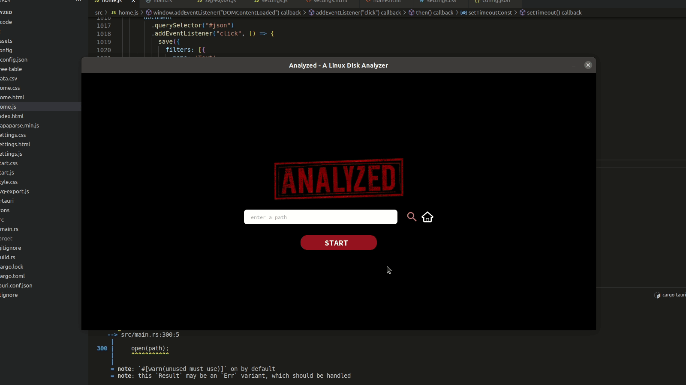

# ANALYZED
An open-source Linux disk analyzer built by RUST, and TAURI. The disk analyzer is fast and yet beautiful.
## Dependencies and required libraries
**Make sure to install the following dependencies before running the application.**
- TAURI
- jQuery
- rustup
- cargo
## How to install and run?
```
git clone https :// github.com/abdelmaksou/analyzed
cd analyzed
cargo tauri dev
```
## How to use?
The application starts a screen in which the user can choose to write the path, choose it, or run the program at the home directory. After that, the application displays both nested pie chart and tree view which dynamically change with each other.

## Functionalities
1. Nested Ring Chart
2. File System Tree
3. Analyzing Preferences
4. Grouping Files in a Pseudo-directory
5. User-defined Controls [work in progress]
6. Files and directory exclusion [work in progress]
7. Retrieve the largest N files [work in progress]
8. Save Charts
#### Further information about the implementation, and design process is [found here](assets/report.pdf).
